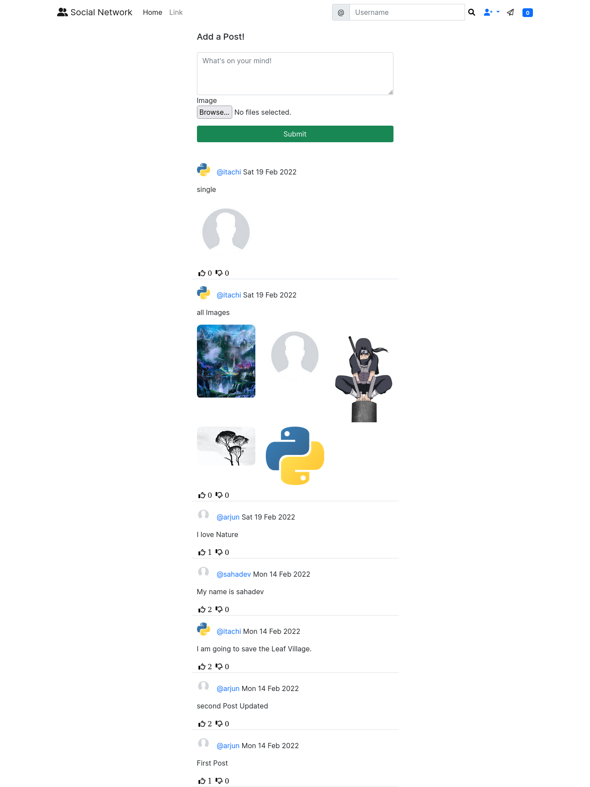
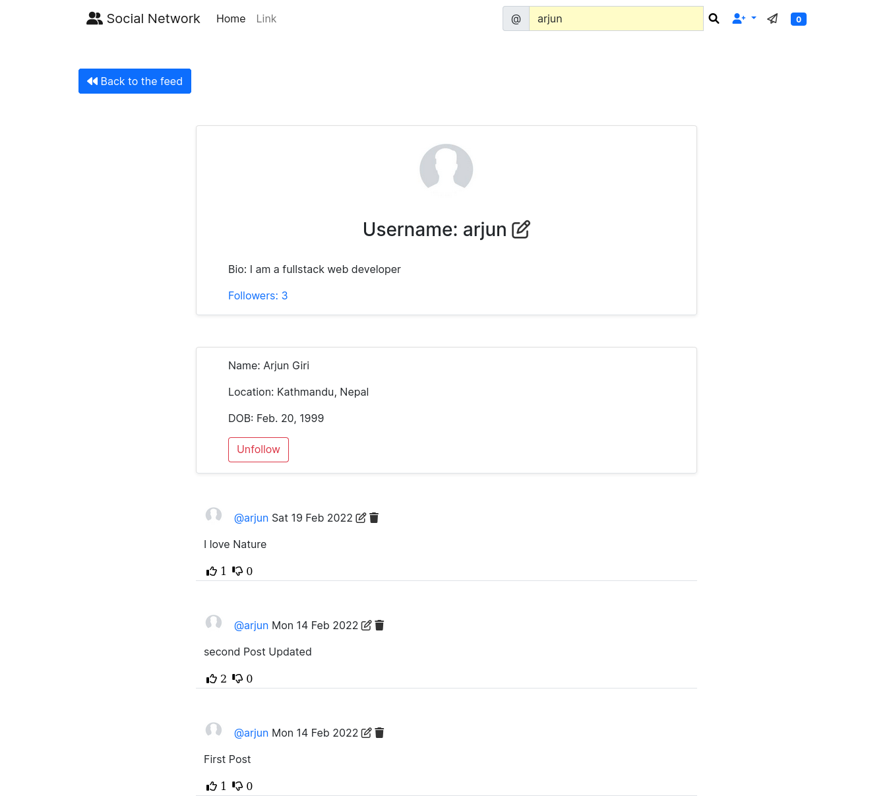

# SOCIAL NETWORK With Django 
A Social Networking site where user can share their views, like or dislike other users post, 
and leave a comment other users post.

# Project Live @https://socialmedia.onrender.com/

### Note: The live site is hosted on free tier @render.com, so it may take some time to load the data.

## Installation

Start by either Downloading Zip file or Clone the repo

```bash
  git clone https://github.com/giriarjun111/Social-Media-with-Django.git
  cd cd Social-Media-with-Django
```

```bash
  Create a virtual environment and activate
      pip install virtualenv
      virtualenv envname
  For Mac OS / Linux:
      source envname/bin/activate
  For Windows:
      envname\scripts\activate
```

```bash
  Rename .env.example to .env and Add the values for the follwing or copy this:
    SECRET_KEY=a0kqo78v_8bv=5jkqbtgt$w3(h7xe&(bspu*6s+429=rh+2xd!
    DEBUG=True
    EMAIL_BACKEND=django.core.mail.backends.smtp.EmailBackend
    EMAIL_HOST=smtp.gmail.com
    EMAIL_PORT=587
    EMAIL_HOST_USER=youremail@gmail.com
    EMAIL_HOST_PASSWORD=yourpassowrd
    EMAIL_USE_TLS=True
```
    
## 🔗 Links
[](https://arjungiri.tk/)
[](https://www.linkedin.com/in/arjun-giri-full-stack-web-developer-08577519b/)
[](https://www.facebook.com/arjun.giri.5099940)


## Features

- USERS can Share their post and their views on other users post.
- USERS can like or dislike and Comment on other users post
- USERS can update their profile
- USERS can follow or unfollow other users
- Authentication by [Django-Allauth](https://django-allauth.readthedocs.io/en/latest/)
- Bootstrap Theme


## Tech Stack

**Client:** Javascript, HTML & CSS

**Server:** Django


## Screenshots
Home Page After User is Logged in


Profile Page of User



